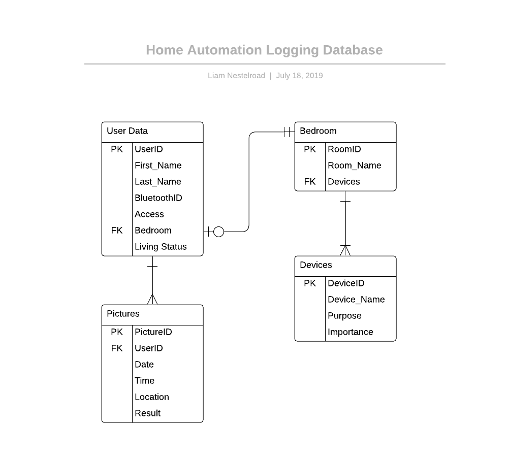

# Home Automation (Gozer the Gozarian)

*********************

## Abstract

The goal for this dummy project is to develope a backbone for an all in one home automation unit. The requirements layed out in this document will by no means be all this project will encompass. The idea is to have scalability in mind as some of the aspect can become quite cumbersome while others my only take a few hours to implement. To begin, there will be 4 main components which will serve as a foundation for the rest.Since this unit will essentially be controlling my entire house, it makes me susceptible to hacking. Naturally, security will be a large part of this final design as I'd be happier if my shit wasn't stolen. This in turn means that every component will run some form of linux (including the wi-fi router).

*********************

## Foundation

Thankfully the requirements for this assignment align with how I want things done. The final result will include:

1. A fully functioning web site which will allow me to access the unit outside of work
2. The non graphical component will of course be the logic behind the google home and the machine learning
3. A database will be implemented to handle all of the logging for the system
4. In the home computer, there will be a Qt application to run and maintain all of the other components.

An over all feature set is listed below but in terms of specifics, required features will be stated in its corresponding section along with future goals.

### Required Features

For the scope of this project the focus will be mainly on the facial recognition security system, the google home to link everything together, and some way to access the system via web site and GUI. The system will need to be able to add new users for clearance and temporary passes. Since this will basically be replacing my lock on my door, there needs to be ways to access the house incase the facial recognition fails or the batteries die. To help with facial recognition errors the system will also implement a form of bluetooth detection which will also double for temporary guests.

### Optional Features

Since I do not always come in though the front doors, I would like to have a second camera geared towards object detection so that the system can recognize my motorcycle and open the garage that way. Additionally, I would like to set this up for extendability as I see fit for future additions. For instance, I would one day like to add an entire entertainment system including music, movies, and lights.

*********************

## Hardware

To drive the unit, there are a few required bits on hardware necessary. For the bare bones requirements, there are only 3 main bit. A Raspberry Pi 3 will be used as the central unit. Through it, the google assistant will be ran and it will talk to the other bits of hardware via ssh. Since the goal here is to make installation very easy, a configured OS with all of the necessary apps and files loaded up will be made. This OS will make use of Raspbian's new release [Buster](https://www.raspberrypi.org/downloads/raspbian/)

As for the camera(s), a small Raspberry Pi Zero w will be used with the Raspberry Pi camera attachment. Since image processing on it is garbage (due to its limited horse power) its feed will be sent off to a different computer for analysis. Images will be taken at one every 5 minutes. Same as with the other raspberry pi, there will be a custom configured OS for this pi based off of Buster.

In order to network all of the components together, a TP-Link wireless router will be used. Unfortunately TP-Link has had some security issues lately so it OS will be replaced with OpenWRT. This will also be beneficial for later on since WRT makes it easy when it comes to setting up ssh bastions or VPN's.

*********************

## Facial Recognition

### Code name: Zuul the Gatekeeper

Thankfully, for this part of the project most of hard work has been done by someone else. Thanks to [Adrian Rosebrock](https://www.pyimagesearch.com/2018/06/18/face-recognition-with-opencv-python-and-deep-learning/), setting up a pi to recognize faces will be pretty ease. Some minor clarifications, however, is that the pi itself will not be doing all of the analyzing. The pi's sole purpose is to take pictures every few seconds when it detects motion and send it off to a different, more powerful, machine. Again, Thanks to el Rey himself, Senor Rosebrock wrote another excellent post about [detection motion with a raspberry pi](https://www.pyimagesearch.com/2015/05/25/basic-motion-detection-and-tracking-with-python-and-opencv/). Configuring all of this however is a bitch and a half since openCV is not supported on pip for raspberry pi's. Once again, Mr. Rosebrock gets the hat trick as his [guide for OpenCV](https://www.pyimagesearch.com/2018/09/26/install-opencv-4-on-your-raspberry-pi/) is a life saver.

*********************

## Google Assistant

### Code name: Gozer the Gozerian

This is actually the easiest part of the unit. Thankfully someone much smarter than me at google wrote some kick ass python libraries that basically just makes the [google assistant](https://developers.google.com/assistant/sdk/guides/service/python/embed/setup) work though a python script. What is really cool about this library though is that you can add custom voice commands which can then do whatever you want. In this case, a few custom command will be set up to ssh into other computers. For now I want just a few simple command to control the doors and make life easier. Eventually, the goal is to have a google home in every room to act as an interface for all of the devices in that room.

* "Okay Google, Peace be with you" = Not if shes been with you first *opens garage door for 2 minutes then closes it and locks the front door.*
* "Okay Google, open the door" = As you wish *unlocks the door*
* "Okay Google, I'm home" = *plays cupcake*

*********************

## Interfacing

Conveniently, the requirements state there needs to be a GUI and a web component. This sets up quite nicely two separate interfaces: one for the client side of things and another for system administration. Since the client side portion needs to be accessible from more than just at home, the web interface will serve quite nicely and the GUI will be a perfect fit for the system admin page.

### Web

Thankfully the design for the site is going to be pretty simple. Thankfully, the Pi will be taking pictures so it will be pretty simple to display the last image taken from the pi. Off to the side of that, the site will have a small little menu which will have options for all sorts of things. For now, the menu will include:

1. Open front door
2. Lock doors
3. See Front Door
4. Who's Home

Eventually I would like to add in features for light controls, camera controls, and garage door control. The site will most likely be hosted through heroku or, if I can get a VPN to work in time, locally. Below is a simple diagram showing the layout and goals for the future.

### GUI

With the client side of things out of the way, the GUI can house all of the options only the admin can access. For instance, not everyone in the house should be able to finagle with camera specifics or just randomly add new users. There will also be things that only the admin cares about such as system diagnostics and specifications. For the time being, the goal in mind for the GUI is a simple window which will have a few options for the things listed above. However, since this project is being done with scalability in mind, there will be options to add devices and configure future features. below is rudimentary design layouts for each menu option.

*********************

## Logging

### Code name: Containment Grid

Thankfully there wont be much in terms of logging. The database software to be used will be sqlite as its easy to use and integrates very well with python. Because the database will house all of the pictures of people entering and user information, it will need a decent chunk of data. Currently the only information will be associated with the security so there will only be about a few tables. They database will be created and handled with sqlite since it has easy integration with python and PyQt5. Thanks to [Lucid Chart](https://www.lucidchart.com/documents#docs?folder_id=home&browser=icon&sort=saved-desc), the ERD can be seen below.

*********************

## Circuitry

### Code name: Vinz Clortho, The Keymaster

Thankfully, the circuitry for this project will not be very complicated. The idea is to have a signal from the pi control a serve to turn the lock. Simple.

#### Plan B

Lets just imagine for a minute that all power in the boulder area suddenly goes off. Uh oh, now everything thats controlling my house is now more useless than an aerospace degree. If everything is locked before the power outage happens then I will be locked out of my door. To solve this, each component will be equipped with an UPS and then set to power off closed with the exception of one door in the back. But wait, everything has power now, except the router has been destroyed by the dog, now what. To help solve this one, if a pi looses connection, it will fail open for now.

## References

[PyQt5 StackWidgets](https://www.tutorialspoint.com/pyqt/pyqt_qstackedwidget.htm)
